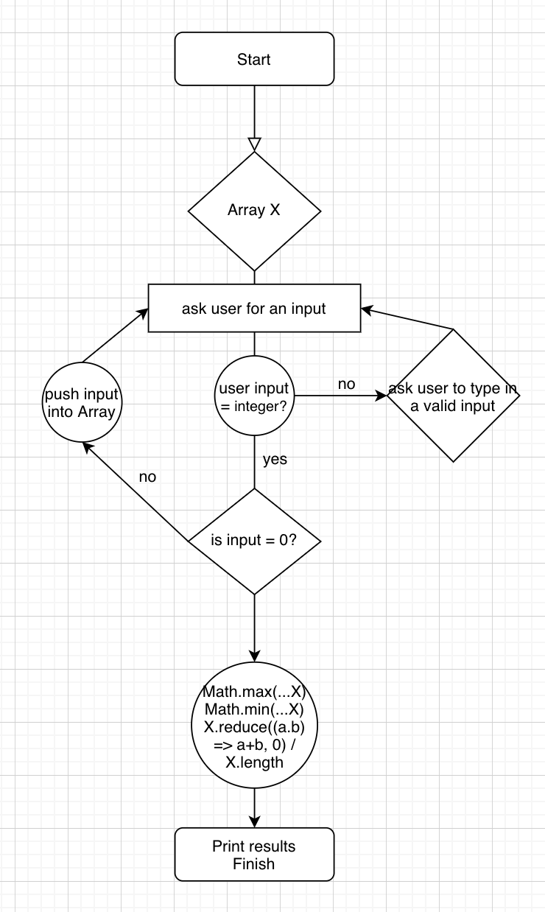

# Record the numbers

## objective
* in this exercise i need to keep a array of X number inputs by user until the input is 0.
* when the input is 0, the program calculates the maximum, minimum, and average of the Array.
* practice Vue.js

## Flow Chart

** I just made a validation rule on the input field so the user can ONLY type numbers.